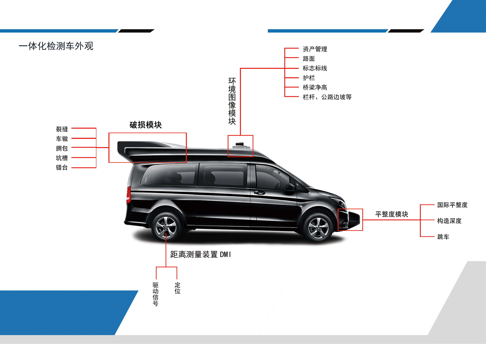
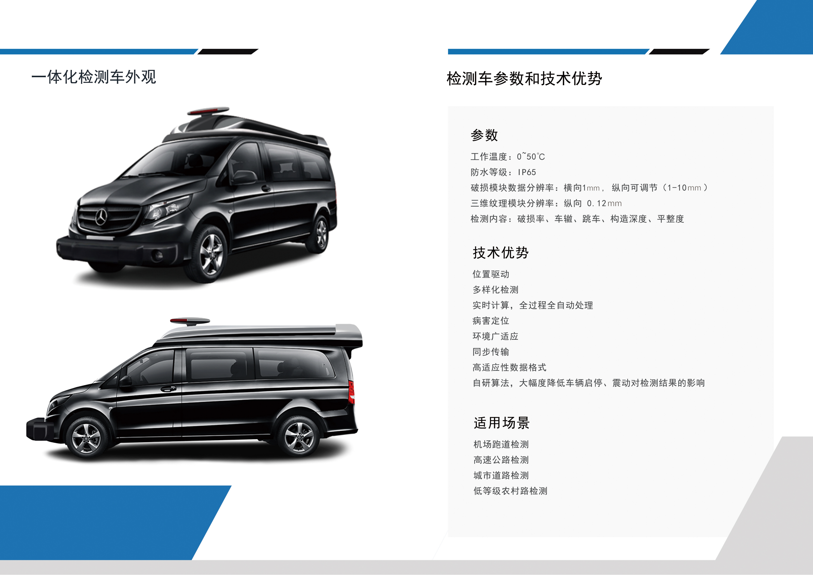

### Hi there 👋,welcome to my Github

- 🌱 I’m currently relearning Vue 
- 🔭 I’m currently working on XinJiang Academic of Transportation Science

# 技术栈
* 后端
  * Java SpringBoot  redis mybatis MySQL
  * C/C++ Qt
* 前端
  * Vue element-ui
* 机器学习
  * TensorFlow
  * PyTorch
* 其他
    * python
    * Linux
    * Arduino/ESP32

<!--

这里时注释，Github主页上不会显示

**CaoZhijian1123/CaoZhijian1123** is a ✨ _special_ ✨ repository because its `README.md` (this file) appears on your GitHub profile.

Here are some ideas to get you started:

- 🔭 I’m currently working on ...
- 🌱 I’m currently learning ...
- 👯 I’m looking to collaborate on ...
- 🤔 I’m looking for help with ...
- 💬 Ask me about ...
- 📫 How to reach me: ...
- 😄 Pronouns: ...
- ⚡ Fun fact: ...

github-readme-stats
github-readme-stats 可以在你的 README 中 获取动态生成的 GitHub 统计信息！

要显示上面的那种GitHub 统计卡片，只需要将下面这行代码复制到你的 markdown 文件中，简单如此！ 更改 ?username= 的值为你的 GitHub 用户名。

[](https://github.com/anuraghazra/github-readme-stats)
1
此外，还可以选择显示的主题模式，在后面调用?theme=THEME_NAME 参数就可以了，内置了很多。如下：

dark, radical, merko, gruvbox, tokyonight, onedark, cobalt, synthwave, highcontrast, dracula

-->

# Github仪表盘

[](https://github-readme-stats.vercel.app/api?username=CaoZhijian1123&theme=radical)

# 最近工作（What have I done recently）


<!--START_SECTION:waka-->

```txt
Other   8 hrs 38 mins   █████████████████████████   99.93 %
Java    0 secs          ░░░░░░░░░░░░░░░░░░░░░░░░░   00.07 %
```

<!--END_SECTION:waka-->

# 工作经历
* 2021.7-2023.1 北京祥运通达土木工程有限公司 技术总监
  * 检测设备软硬件研发
  * 服务器运维
  * 数据管理平台后端研发
* 2023.2 至今 新疆交通科学研究院有限责任公司
  * 路基路面
  * 智慧交通 

# 项目经历
* 2021.04-2022.03  清华大学丰田联合研究院  “未来智慧城市”专项中“交通基础设施全自动数据采集及智能分析平台建设”


* 2021.07-2022.05  清华大学交通研究所智能检测车研发 技术总负责



# 学术成果
1. 呙润华,徐粒,彭慧婷等.三维线激光国际平整度指数计算原理及测试评估[J].清华大学学报(自然科学版),2021,61(11):1316-1324.DOI:10.16511/j.cnki.qhdxxb.2020.26.041. 
[阅读原文](paper/CalculationPrincipleAndTestEvaluationOfIRIof3DlineLaser.pdf)
2. Cao, Zhijian; Guo, Runhua. Image Recognition Based Traffic Sign Facilities Damage Detection. Transportation Research Board 100th Annual Meeting, Transportation Research Board, 2021, 13p
/view/1759046 [阅读原文](paper/ImageRecognitionBasedTrafficSignFacilitiesDamageDetection.pdf)

# 证书
* CET6
* 计算机二级 MS Office/ Java

# 获奖情况
* 2018.12 清华大学志愿公益优秀奖 `清华大学`
* 2020.9 第六届中国国际“互联网+”大学生创新创业大赛新疆赛区选拔赛决赛 创意组银奖 `新疆维吾尔自治区教育厅`

# 社交网站（Social networking sites）


     https://space.bilibili.com/350683936


     https://console.blog.csdn.net/


     https://gitee.com/ZhijianCao_admin


     https://github.com/CaoZhijian1123


# 联系我(CONTACT ME)

📫 How to reach me

**邮箱(EMAIL)**:email:  thucaozj@outlook.com  <br/>
**清华校友邮箱**:email:  caozj17@tsinghua.org.cn